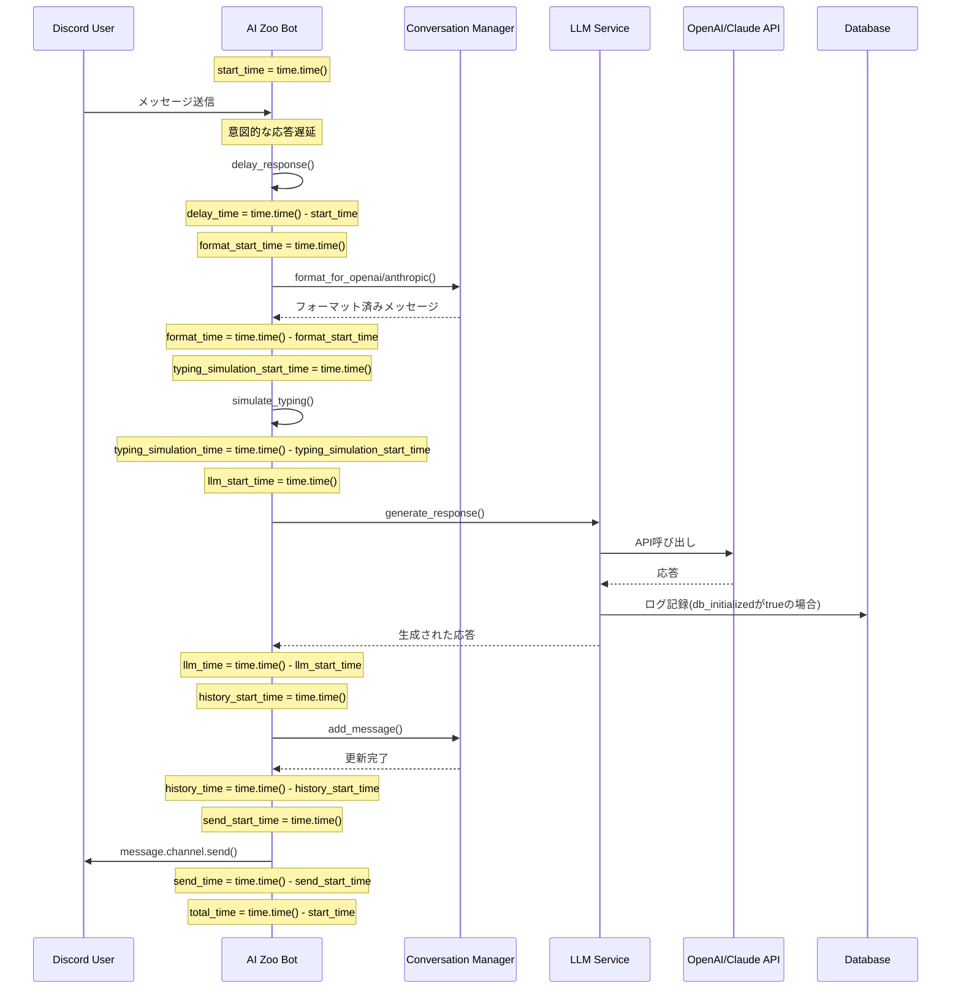
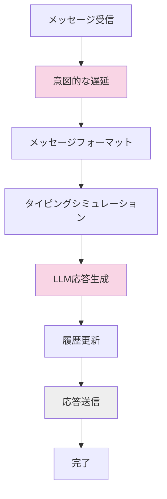

# Discord Bot 応答プロセスのタイミング解析

このドキュメントでは、AI Zooボットの応答生成プロセスのタイミングフローを図解します。

## 応答プロセスの時間計測ポイント

`respond_to_message`メソッドでは、以下の時間が計測されています：

1. **全体処理時間 (total_time)**: メソッド開始からメッセージ送信完了まで
2. **初期遅延時間 (delay_time)**: 意図的な応答遅延（思考/タイピングシミュレーション）
3. **メッセージフォーマット時間 (format_time)**: 会話履歴をLLMに適した形式に変換する時間
4. **タイピングシミュレーション時間 (typing_simulation_time)**: タイピングシミュレーションを行う時間
5. **LLM生成時間 (llm_time)**: 外部AI APIを呼び出して応答を生成する時間
6. **履歴更新時間 (history_time)**: 応答を会話履歴に追加する時間
7. **メッセージ送信時間 (send_time)**: Discordチャネルに応答を送信する時間

## シーケンス図



## タイミング分析フロー



## 処理時間の算術関係

total_time（全体処理時間）は各処理段階の時間の合計に等しくなります：

```
total_time = delay_time + format_time + typing_simulation_time + llm_time + history_time + send_time
```

ただし、`typing_simulation_time`はコード内で明示的に計測されており、LLM応答生成時間と並行して実行されます。

また、各段階の比率は一般的に次のようになります：

1. **delay_time**: 意図的な遅延（~1-10秒、設定値による）
2. **llm_time**: LLM API処理時間（~1-15秒、モデルと入力による）
3. **typing_simulation_time**: タイピングシミュレーションの時間（通常短い）
4. **その他の処理時間**: 通常短い（各0.1秒未満）

## パフォーマンス最適化のポイント

各処理段階の時間を分析することで、ボトルネックを特定できます：

1. **LLM生成時間の最適化**
   - より応答速度の速いモデルに切り替える（例：GPT-4からGPT-3.5-turboへ）
   - プロンプトを短くして処理速度を向上
   - トークン数の制限を最適化

2. **初期遅延の調整**
   - `min_response_delay`と`max_response_delay`環境変数を調整
   - 即時応答が必要な場合は遅延を短くする

3. **メッセージフォーマット最適化**
   - 会話履歴の長さを最適化
   - 不要なコンテキスト情報を削減

## 実際の計測結果の例

```
Message response timing breakdown:
  - Initial Delay: 7.35 seconds
  - Message Formatting: 0.02 seconds
  - Typing Simulation: 0.05 seconds
  - LLM Generation: 3.65 seconds
  - History Update: 0.01 seconds
  - Message Sending: 0.12 seconds
  - Total Processing: 11.15 seconds
```

この例では：
* 全体処理時間: 11.15秒
* 意図的な遅延: 7.35秒 (65.9%)
* タイピングシミュレーション: 0.05秒 (0.4%)
* LLM生成: 3.65秒 (32.7%)
* その他の処理: 0.15秒 (1.4%)

応答速度を向上させるには、意図的な遅延を短縮するか、より高速なLLMモデルを使用することが最も効果的です。