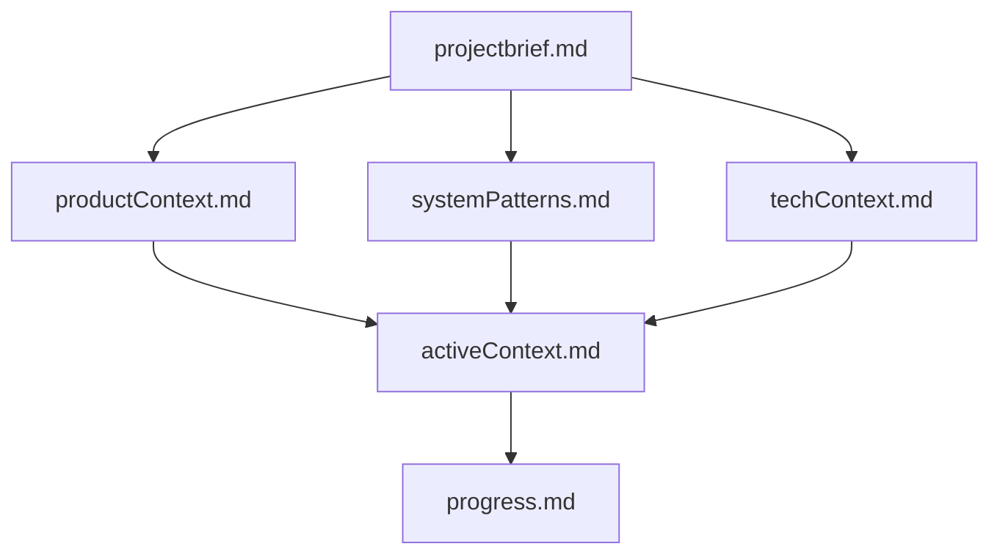

# System Patterns

## Architecture Overview
The Memory Bank follows a hierarchical documentation architecture where files build upon each other in a clear dependency structure. This ensures that information flows logically from foundational concepts to specific implementation details.

```
projectbrief.md → [productContext.md, systemPatterns.md, techContext.md] → activeContext.md → progress.md
```

## Key Technical Decisions

### Markdown-Based Documentation
All Memory Bank files use Markdown format to ensure:
- Readability across different platforms
- Version control compatibility
- Structured formatting with headers, lists, and code blocks
- Support for embedded diagrams (via Mermaid)

### Hierarchical Structure
The Memory Bank uses a hierarchical structure to:
- Separate concerns into distinct files
- Establish clear dependencies between information types
- Allow for targeted updates to specific aspects of the system
- Provide a consistent mental model for navigation

### Mandatory Reading Protocol
Cline must read all Memory Bank files at the start of every task to ensure:
- Complete context awareness
- Consistent application of project patterns
- Accurate understanding of current state
- Alignment with project goals

## Design Patterns

### Single Source of Truth
- `projectbrief.md` serves as the foundation document
- All other documents must align with and support the project brief
- Conflicts are resolved by referring to the project brief

### Living Documentation
- Documentation evolves as the project progresses
- Regular updates maintain accuracy
- Historical context is preserved when relevant

### Separation of Concerns
- Each file has a specific focus and purpose
- Information is organized to minimize redundancy
- Cross-references are used when information relates to multiple areas

## Component Relationships

### Core Files Relationship


### Information Flow
1. **Foundation Layer**: `projectbrief.md` establishes core requirements and goals
2. **Context Layer**: `productContext.md`, `systemPatterns.md`, and `techContext.md` provide specific context
3. **Active Layer**: `activeContext.md` focuses on current work and decisions
4. **Progress Layer**: `progress.md` tracks implementation status and issues

### Extension Mechanism
Additional context files can be created within the memory-bank/ directory when needed to document:
- Complex features
- Integration specifications
- API documentation
- Testing strategies
- Deployment procedures
